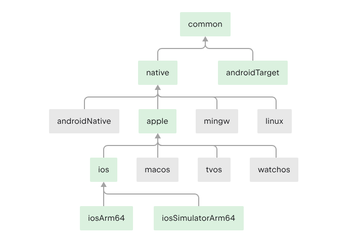

# Kotlin Multiplatform

## 官方文档
1. [https://www.jetbrains.com/help/kotlin-multiplatform-dev/get-started.html](https://www.jetbrains.com/help/kotlin-multiplatform-dev/get-started.html)
2. [https://kotlinlang.org/docs/multiplatform.html](https://kotlinlang.org/docs/multiplatform.html)

## demo简介

Kotlin Multiplatform demo项目，包含Android端，iOS端以及win端.其中win端用JavaFX实现UI。

## 项目结构
- app:Android项目
- iosApp：iOS项目
- jfx：JavaFX项目
- shared：kotlin跨平台项目

shared中的src又包含了各级子目录，表示编译的目标源代码。

在KMP(Kotlin Multiplatform)中，默认的目标层次结构如下图：  
  
当然还有和android同级的jvm()和js()。其中绿色表示被加入项目的构建目标。灰色表示未加入的。  
注意，结构是有父子关系的，common是根节点，apple是苹果端的根节点。根据层次结构,我们还可以编写平台特有的api。比如demo中，在appleMain源代码集中定义一个expect函数iGreetingApple()，
这个函数将只在apple平台中可以调用，其他平台将无法调用。又或者在native中定义一个expect函数,那这个函数将在androidNative、apple、mingw、Linux
平台中可以调用，在androidTarget中无法调用。

> - 当定义expect函数时，ide会提示需要添加待实现的actual函数，也可以在此注意到整个‘层次结构’，
比如在apple上打上勾，表示在apple的源代码下编写实现代码，那么再下面的目录（ios、macos等）中就不用添加actual的实现代码了。
> - 编译目标，可以在kotlin{}块中配置，有js()，androidTarget()，jvm()等。
> - 源代码集也可以在kotlin{}块中配置，可以指定某个平台的引入的三方库信息。

## 踩坑点

1. 没设定编译目标前，无法引入源集进行三方库依赖
2. Swift中在非主线程调用kotlin suspend
   函数时，需要再gradle.properties中添加[`kotlin.native.binary.objcExportSuspendFunctionLaunchThreadRestriction=none`](https://kotlinlang.org/docs/native-ios-integration.html#calling-kotlin-suspending-functions)
3.
在非kotlin语境中调用kotlin顶层函数时，需具体的文件名+Kt后缀（当然可以用注解更改生成的文件名）。而且需要actual具体实现的文件的文件名，不能用expect声明的文件的文件名。比如demo中的iGreetingApple()
，定义在CommonApple文件中，但具体实现在Common.apple.ios文件中，那么调用时就得用Common_apple_iosKt.iGreetingApple()的方式进行调用。

## 后续目标

- [ ] 完整的天气查询项目
- [ ] 用Compose Multiplatform完成多端UI
- [ ] 完善的文档（踩坑点）